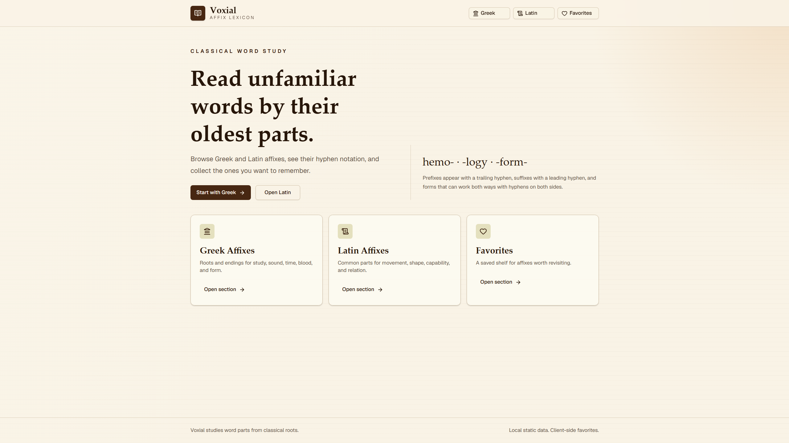
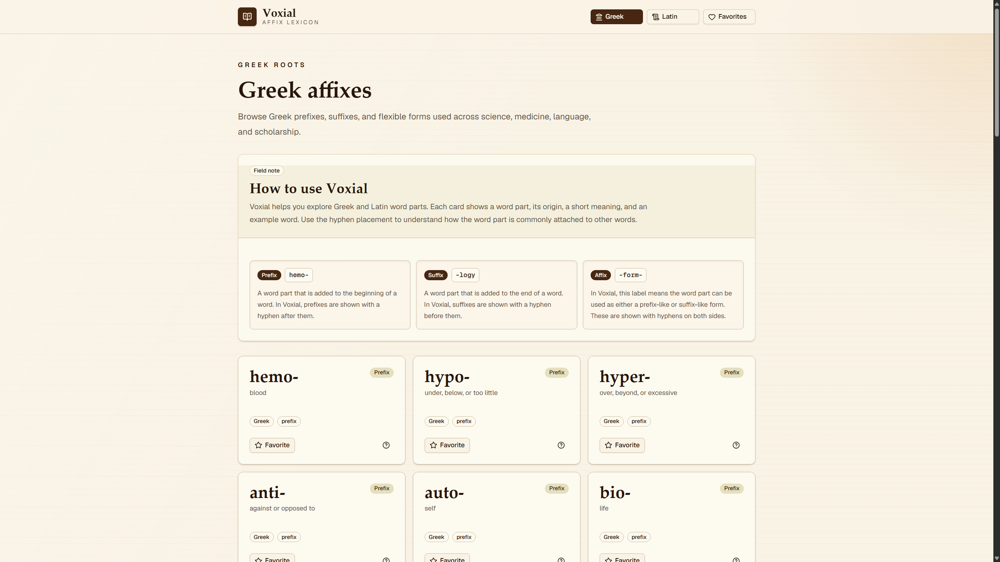
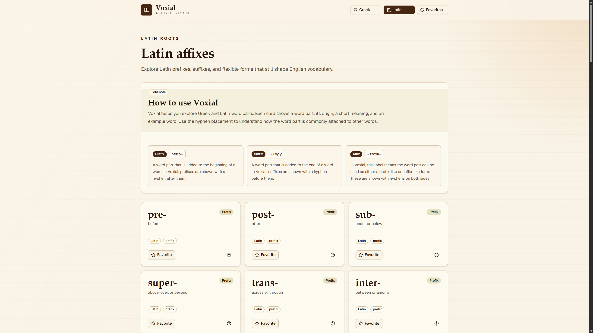
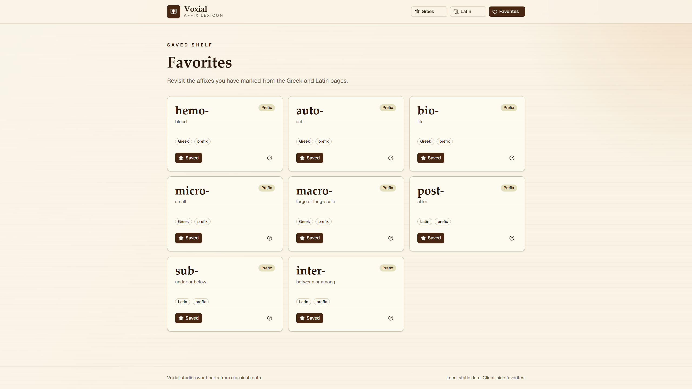

<div align="center">

# 📚 Voxial

**A focused reference for exploring common Greek and Latin word parts.**


</div>

Voxial organizes 120 Greek and Latin affixes into a clear, approachable study
tool. Browse meanings and examples, learn how hyphen notation describes word-part
placement, and save useful entries for later review.

---

## 📸 Preview



<table>
  <tr>
    <td width="50%">
      
    </td>
    <td width="50%">
      
    </td>
  </tr>
  <tr>
    <td align="center"><strong>Greek collection</strong></td>
    <td align="center"><strong>Latin collection</strong></td>
  </tr>
</table>



---

## 📖 About

Voxial began as a passion project inspired by an interest in language and
etymology. It organizes commonly used Greek and Latin morphemes—meaningful word
parts represented as prefixes, suffixes, and flexible forms—into a visually
structured reference.

Learning these components can make unfamiliar vocabulary easier to approach.
For example, recognizing that `-psych-` concerns the mind, `-path-` can indicate
disease or suffering, and `-logy` means study provides a useful clue that
_psychopathology_ concerns the study of mental disorders. Voxial supports this
kind of pattern recognition while allowing learners to save useful affixes for
later review.

---

## 🚧 Status

> [!NOTE]
> Voxial is currently paused and is not under active development. It remains a
> personal project that may be refined and published in the future. There is
> currently no public deployment.

---

## ✨ Features

- Browse **50 Greek** and **70 Latin** word parts.
- Distinguish prefixes, suffixes, and flexible forms through clear hyphen
  notation such as `hemo-`, `-logy`, and `-form-`.
- Review each affix's origin, type, short meaning, example word, and explanation.
- Open examples in focused, accessible dialogs.
- Save favorites locally in the browser without creating an account.
- Use the reference across desktop and smaller screens through a responsive
  interface.
- Study within a restrained, classical visual design inspired by reference books
  and manuscripts.

---

## 🛠️ Tech Stack

| Area          | Technologies                                          |
| ------------- | ----------------------------------------------------- |
| Application   | Next.js 16, React 19, TypeScript                      |
| Styling       | Tailwind CSS 4                                        |
| UI components | shadcn/ui, Radix UI, Lucide icons                     |
| Data          | Local, typed TypeScript records                       |
| Persistence   | Browser `localStorage`                                |
| Tooling       | npm, ESLint, Prettier, TSX, custom dataset validation |

The project deliberately uses local data and client-side persistence. It does
not currently require a database, authentication service, or external API.

---

## 🚀 Run Locally

### Prerequisites

- A current LTS release of [Node.js](https://nodejs.org/)
- npm

### Setup

```bash
git clone https://github.com/Zanny7/Voxial.git
cd Voxial
npm install
npm run dev
```

Open [http://localhost:3000](http://localhost:3000) in your browser.

To create and run a production build:

```bash
npm run build
npm run start
```

---

## 🧪 Data Validation

Affix records live in `src/data/affixes.ts`. Every entry has a constrained
origin and type, a display form with the expected hyphen notation, a concise
meaning, and one example with an explanation.

Run the dataset checks with:

```bash
npm run validate:data
```

The same validation is available through the project's current test command:

```bash
npm test
```

Additional development checks include:

```bash
npm run lint
npm run format:check
```

---

## 📁 Project Structure

```text
src/
├── app/             # App Router pages, layout, favicon, and global styles
├── components/      # Feature components and reusable UI primitives
├── data/            # Typed Greek and Latin affix records
└── lib/             # Favorites persistence and shared utilities
scripts/             # Dataset validation
docs/images/         # README screenshots
```

---

## 🙏 Credits & Notes

- The interface is built with [Next.js](https://nextjs.org/),
  [Tailwind CSS](https://tailwindcss.com/),
  [shadcn/ui](https://ui.shadcn.com/), and
  [Lucide](https://lucide.dev/).
- The included affix definitions and examples are maintained as project-local
  educational content. They are not intended to replace a scholarly dictionary
  or etymological source.
- Favorites are stored only in the current browser and are not synchronized
  between devices.
